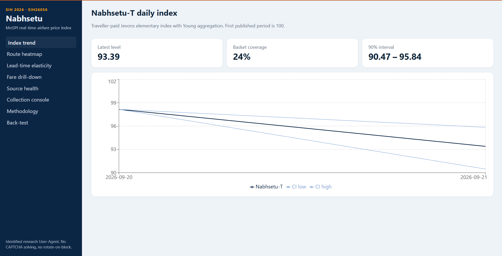
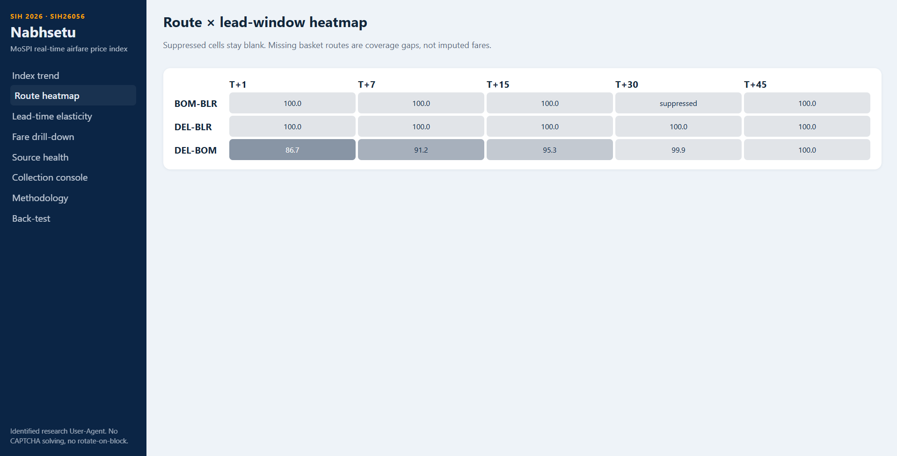
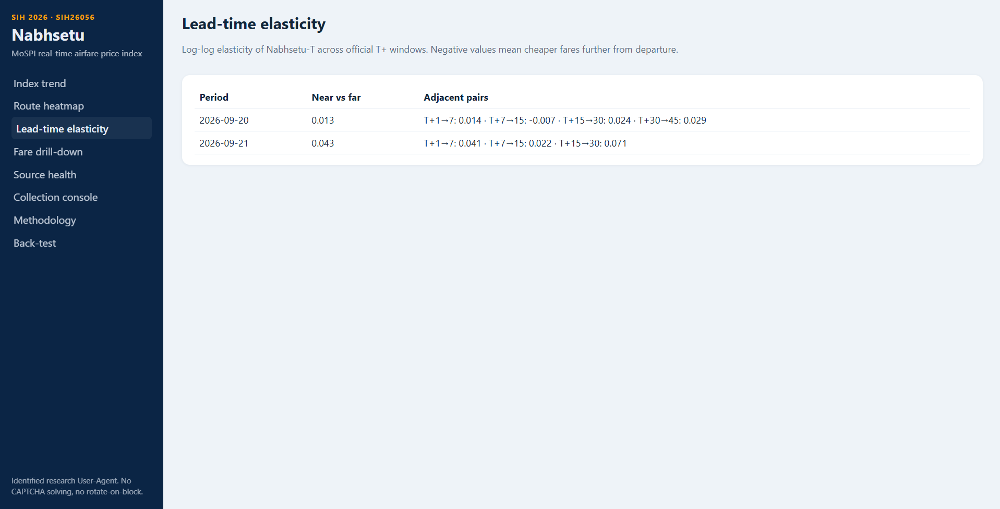
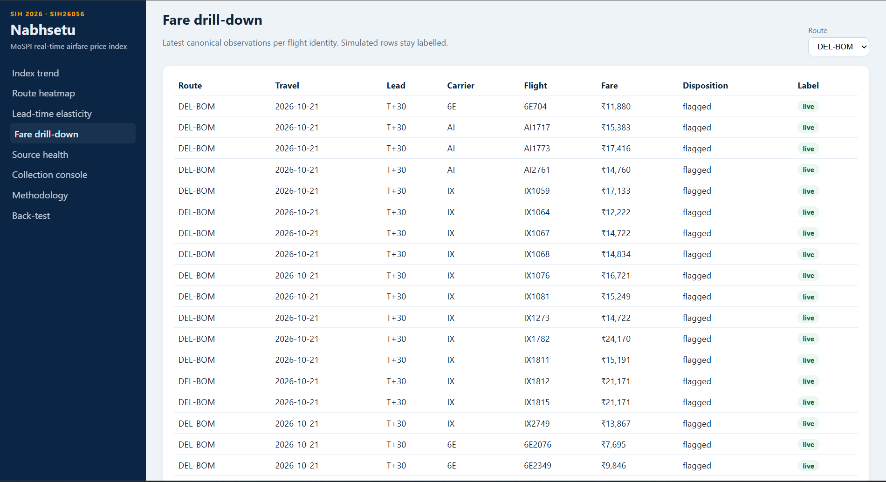
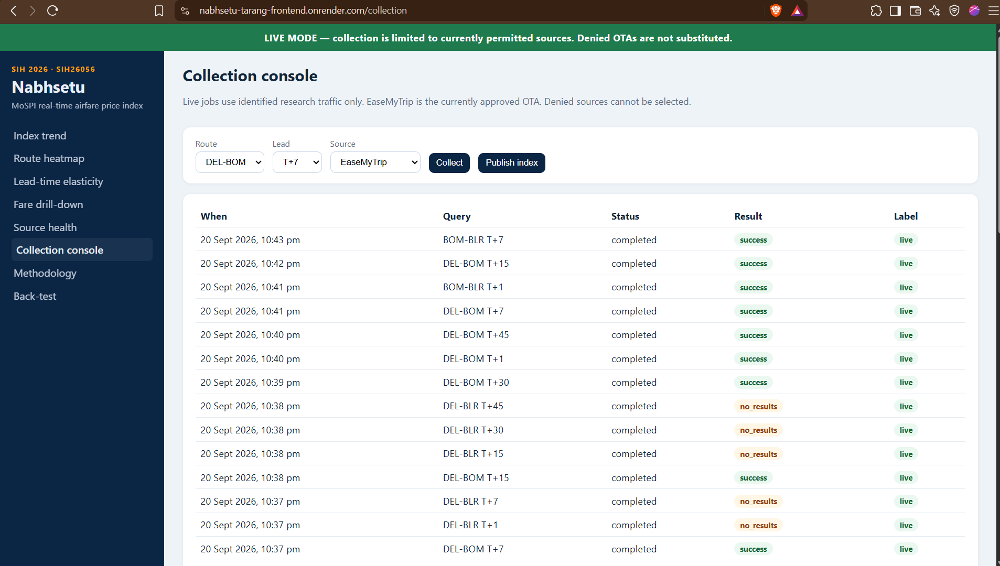
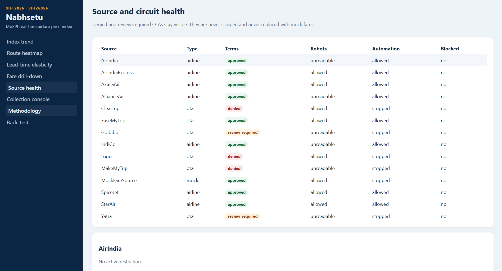
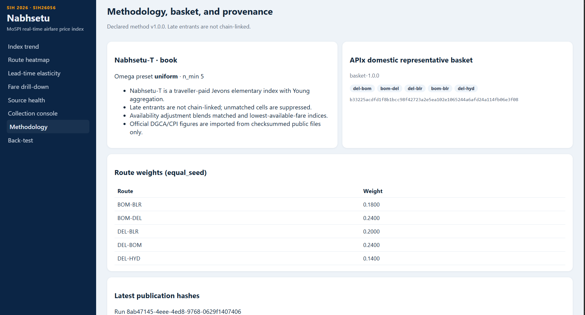

# Nabhsetu — Real-Time Airfare Price Index for India

**SIH 2026 · Problem Statement SIH26056**

Nabhsetu is a compliance-first platform for collecting permitted airfare
observations and constructing a near-real-time Airfare Price Index for India.

**Naming:** *Nabhsetu* is the platform. *APIx* is the index family it
publishes — `APIx-B` (base fare + YQ/YR), `APIx-T` (traveller-paid, the
headline) and `APIx-A` (all-in checkout). Index codes are always `APIx-*`.

## What the platform does

1. Typed `FareQuery` enters the system.
2. `ComplianceGovernor` decides ALLOW / DENY / REVIEW_REQUIRED before any collector.
3. `SourceCapabilityRegistry` and `AcquisitionRouter` choose a permitted adapter.
4. `NetworkEgressManager` supplies a **direct** egress lease (proxy providers are optional).
5. Live airline/OTA sources run through HTTP, embedded-JSON, and governed
   Playwright adapters only when robots and reviewed terms allow automation.
6. `MockFareSource` remains isolated and always labels fixtures as simulated.
7. Observations are stored immutably with SHA-256 provenance and `supersedes_id` corrections.
8. The quality gate maps quotes to `ACCEPTED` / `WINSORISED` / `QUARANTINED` / `EXCLUDED`.
9. `apix_index` publishes versioned APIx-T daily/weekly/monthly series (Jevons, availability, Young).
10. Authenticated `/v1` APIs serve NSO/RBI consumers (JSON, CSV, SDMX-JSON).
11. Scheduler, collection worker, and index publisher run from the Postgres job queue.
12. The React dashboard shows trend, heatmap, elasticity, source health, collection, methodology, and back-test panels.

Do not present mock numbers as measurements of Indian airfares. Both dashboards
label simulated data: the React app carries a banner stating mock, live or
policy-denied on every page, and the analyst dashboard shows a `SYNTHETIC`
badge beside the headline plus a note in the chart footer, so a cropped
screenshot of a chart still says what it is.

## Quick start (live presentation)

```bash
cp .env.example .env
docker compose -f docker-compose.yml -f docker-compose.live.yml up --build
```

- API: http://localhost:8000
- OpenAPI: http://localhost:8000/docs
- Dashboard: http://localhost:5173
- Data mode: `APIX_DATA_MODE=live`
- Egress: `APIX_EGRESS_MODE=direct`

Collect EaseMyTrip DEL → BOM T+7 from the collection console, then publish.
Denied OTAs cannot be selected. Do not pass `--profile live-schedule` unless
you intend a daily EaseMyTrip basket run.

Laptop SQLite live demo:

```bash
cd backend
python -m venv .venv
.venv\Scripts\activate
pip install -e ".[live,test]"
python -m playwright install chromium
set APIX_DATABASE_URL=sqlite+aiosqlite:///./data/apix-live-demo.db
set APIX_API_KEY=change-me
set APIX_DATA_MODE=live
python scripts/live_demo.py
uvicorn app.main:app --reload
```

## Mock fallback (no network)

```bash
docker compose up --build
```

Submit a DEL → BOM job and publish:

```bash
curl -X POST http://localhost:8000/collection-jobs \
  -H "X-API-Key: change-me" \
  -H "Content-Type: application/json" \
  -d "{\"origin\":\"DEL\",\"destination\":\"BOM\",\"lead_time_days\":7}"

curl -X POST http://localhost:8000/v1/index/publish \
  -H "X-API-Key: change-me"
```

Without Docker (mock):

```bash
cd backend
python -m venv .venv
.venv\Scripts\activate
pip install -e ".[test]"
set APIX_DATABASE_URL=sqlite+aiosqlite:///./apix.db
set APIX_API_KEY=change-me
set APIX_DATA_MODE=mock
uvicorn app.main:app --reload
```

## Tests

```bash
cd backend
pip install -e ".[test]"
pytest
```

```bash
cd frontend
npm install
npm test
```

Tests never contact live airline or OTA websites. Parsers are exercised against
stored fixtures. Live collection scripts must be run explicitly.

## Offline demo from a cold clone

The repository ships without a database: `data/` and `Datasets/` are
gitignored, so a fresh clone has no quotes and no reference series. Build a
full history locally with the simulator:

```bash
make demo        # init + backfill (240 days, simulated) + index + status
make serve       # http://127.0.0.1:8000/dashboard/
```

`make demo` is equivalent to:

```bash
python cli.py init
python cli.py backfill --simulate --days 240 --end 2026-07-31
python cli.py index
```

`--simulate` is **required**. The synthetic rung ships `enabled: false` in
`config/sources.yaml` so it can never run in a deployment by accident; without
the flag (or `APIX_ENABLE_SIMULATOR=1`) `backfill` refuses and names the rung
that declined and why. Every simulated row is stamped `is_synthetic=1` and the
API and dashboard label it all the way through. Do not present those numbers
as measurements of Indian airfares.

## Official-file import and back-test

Never paste fabricated DGCA/CPI numbers. Download a public file, then:

```bash
python cli.py load-cpi --dir Datasets                       # .xlsx or .csv
python cli.py load-dgca path/to/dgca.csv \
    --source-url https://official.example/file
python cli.py index
python cli.py backtest --comparator dgca                    # PS comparator
python cli.py backtest --comparator cpi --basis book        # CPI Transport
```

DGCA rows loaded **without** `--source-url` are kept but flagged
`is_placeholder=1`, and the back-test refuses to use them — a hand-made CSV
cannot become a published agreement statistic by accident.

The back-test needs at least 6 overlapping months and reports
`reportable: false` with the reason below that, rather than a number nobody
can interpret. It always prints its caveats, including whether the APIx side
is synthetic.

The equivalent commands on the `backend/` service:

```bash
cd backend
python -m app.cli import-dgca path/to/dgca.csv --source-url https://official.example/file
python -m app.cli import-cpi path/to/cpi.csv --source-url https://official.example/file
python -m app.cli run-index
python -m app.cli backtest --comparator dgca
```

## Explicit live checks

```bash
cd backend
pip install -e ".[live]"
python -m playwright install chromium
python scripts/review_ota_policies.py
python scripts/live_collect_otas.py
```

These commands use an identified research User-Agent and persist real
observations or typed denial states; they never substitute fixture fares.

Laptop one-cell demo (EaseMyTrip DEL-BOM T+7, then publish):

```bash
python scripts/live_demo.py
```

## Dashboard Screenshots

- **Index Graph**: Visualizing the computed Airfare Price Index.
  
- **Route Heat Map**: Highlighting fare intensities across routes.
  
- **Fare Elasticity**: Exploring price changes by lead time.
  
- **Fare Drill-down**: Detailed inspection of individual routes.
  
- **Data Collector**: The live acquisition engine interface.
  
- **Source Health**: Reliability and compliance metrics for OTAs.
  
- **Methodology**: Technical index computation formulas.
  

## Documentation

- [Architecture](docs/architecture.md)
- [Index methodology](docs/index-methodology.md)
- [Acquisition engine](docs/acquisition-engine.md)
- [Data model](docs/data-model.md)
- [Compliance](docs/compliance.md)
- [Network egress](docs/network-egress.md)
- [Source onboarding](docs/source-onboarding.md)
- [OTA source review](docs/ota-source-review.md)
- [DGCA import](docs/dgca-import.md)
- [Back-test honesty](docs/backtest-honesty.md)
- [Complete project usage guide](docs/Nabhsetu-Project-Usage-Guide.md)
- [Project usage presentation](docs/Nabhsetu-Project-Usage-Guide.pptx)
- [Deployment](docs/deployment.md)
- [SIH demo](docs/sih-demo.md)
- [Operations](docs/operations.md)
- [30-day run manifest template](docs/30-day-run-manifest.md)
