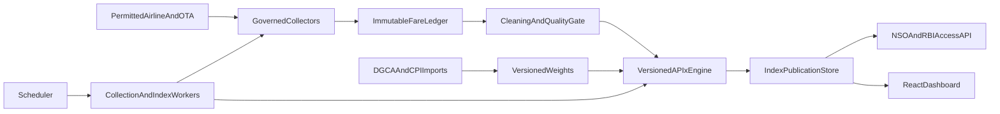

# Architecture

APIx is a modular monolith. Collection workers, the API, the index publisher,
and the operator dashboard share one PostgreSQL/Timescale database. Browser and
HTTP collectors are plugins behind a single router; they are not a scrape
waterfall.

## Packages

| Path | Responsibility |
|------|----------------|
| `backend/app/domain` | Enums and Pydantic value objects |
| `backend/app/acquisition` | Governor, registry, router, scheduler, collector contract |
| `backend/app/network_egress` | Controlled egress, sticky sessions, health |
| `backend/app/sources` | Isolated airline, OTA, and mock plugins |
| `backend/app/database` | SQLAlchemy models, repositories, Alembic |
| `backend/app/quality` | Validation, Tukey/Hampel, publication mapping |
| `backend/app/pipeline` | Quote adapter and index publisher |
| `backend/app/reference_data` | Checksum-preserving DGCA/CPI file loaders |
| `backend/app/backtesting` | Honest official-file comparison |
| `backend/app/worker` | Scheduler, collection worker, publisher |
| `backend/apix_index` | Pure statistical functions (no I/O) |
| `frontend/` | React/TypeScript operator dashboard |

The index package must not import FastAPI, collectors, or database sessions.

## Runtime defaults

- `APIX_DATA_MODE=mock` — `MockFareSource` only; responses carry `is_simulated`.
- `APIX_EGRESS_MODE=direct` — no proxy provider required.
- Restricted reads and writes require `X-API-Key`.
- Postgres schema is owned by Alembic (`0001_initial`, `0002_index_publication`). SQLite tests use `create_all`.

## Collectors in this system

Governed HTTP, embedded JSON, static HTML, and identified-UA Playwright adapters
are implemented. Live collection stops on 403/CAPTCHA/robots denial and records
the source state without substitution.
